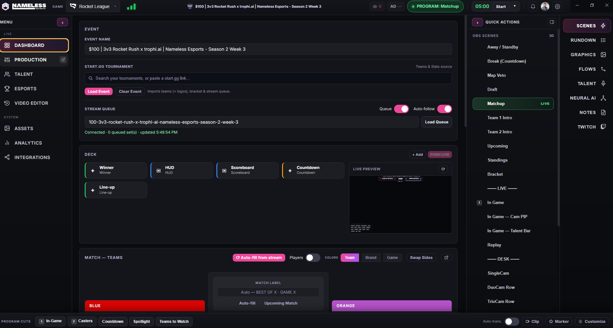
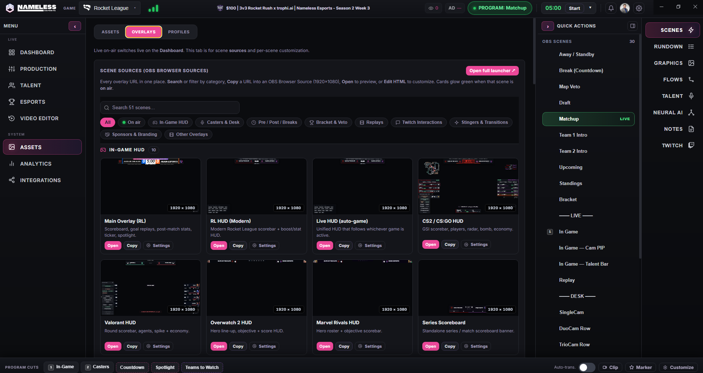
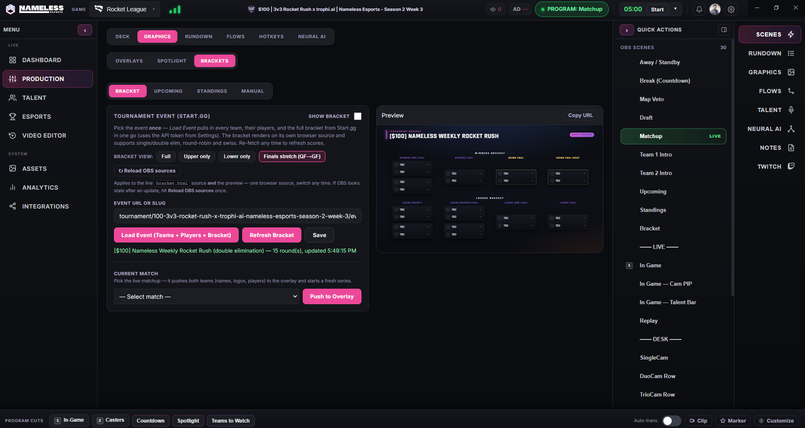
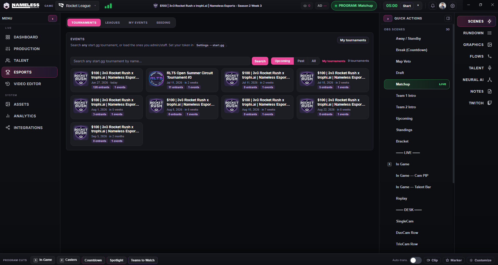
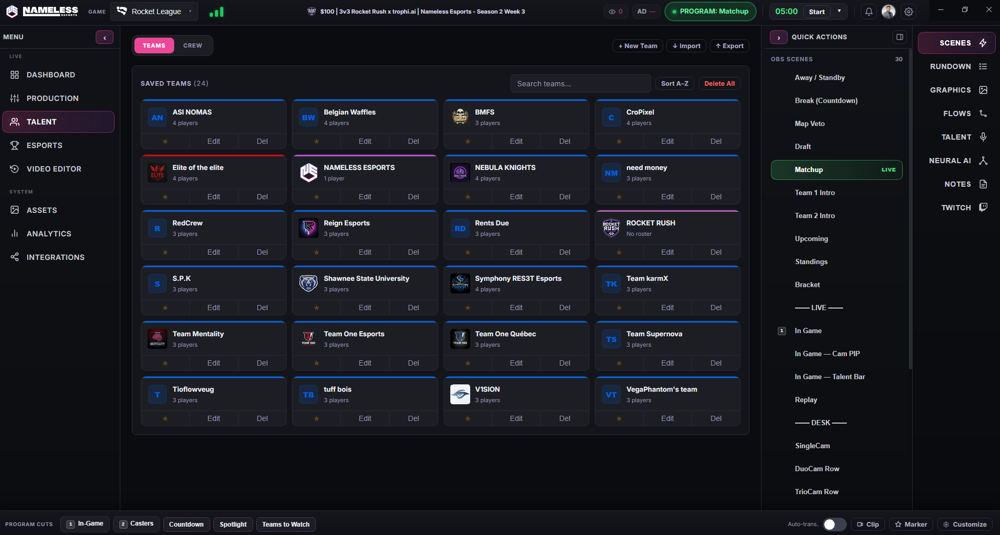
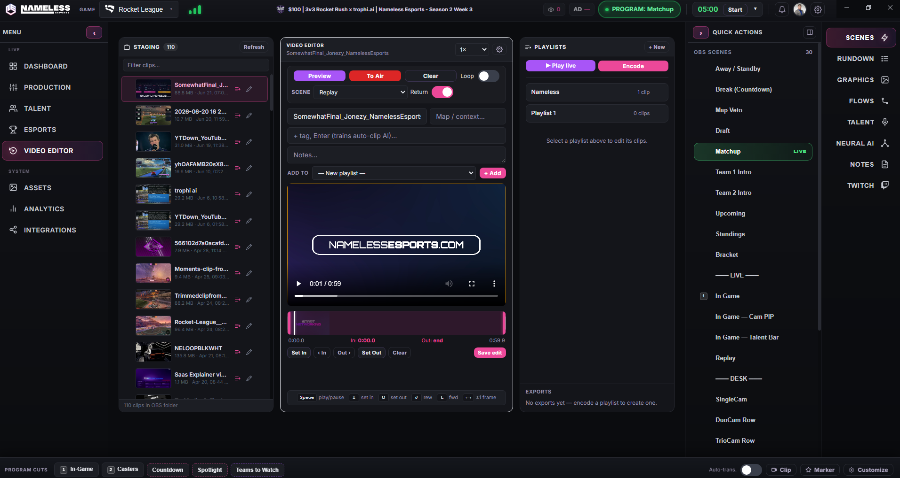
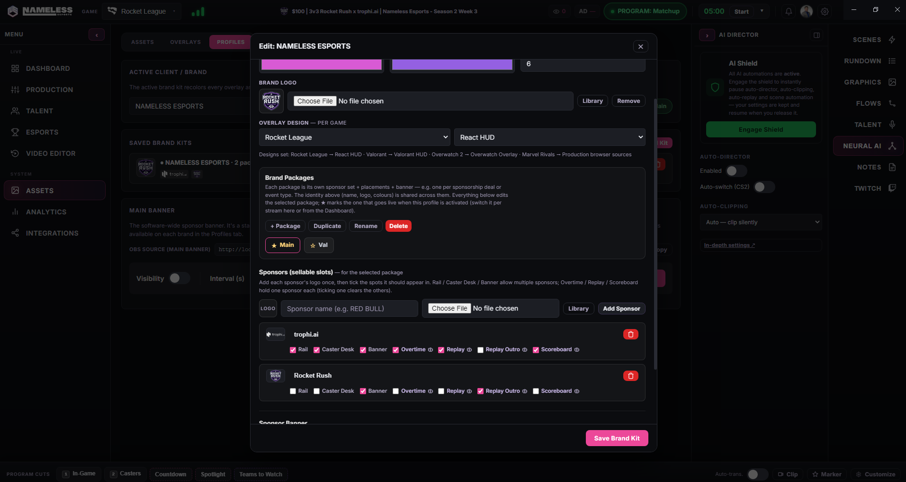
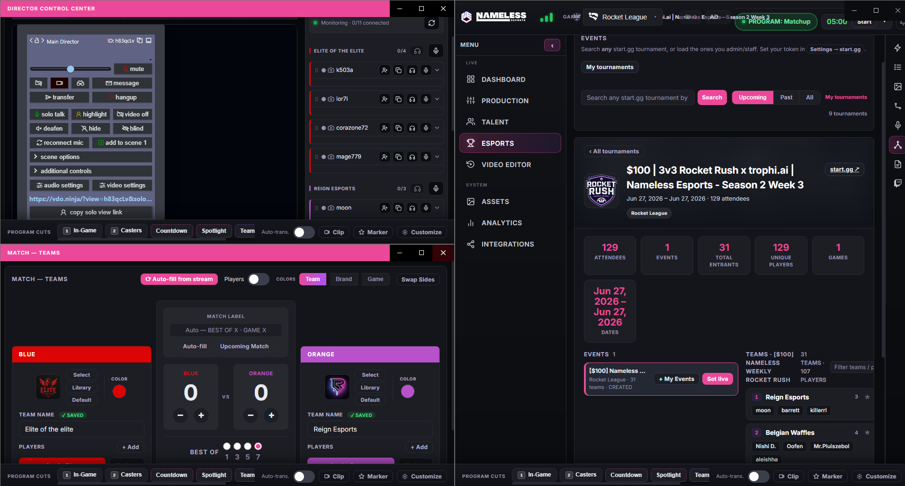

# NE Broadcast Suite

**Professional esports broadcast overlay suite for Windows** — built by [Armour Studios](https://github.com/armour-studios).

[](https://creativecommons.org/licenses/by-nc-nd/4.0/)
[](https://github.com/armour-studios/NEBroadcastSuite/releases/latest)

A local Electron control room for live esports production. Run the app, add a handful of browser sources in OBS, and you get a complete overlay system — live HUDs, brackets, replays, sponsor branding, talent cameras, and an AI director — all driven from one producer cockpit.

---

## Download

**[Latest Release →](https://github.com/armour-studios/NEBroadcastSuite/releases/latest)**

Run the installer, launch from your desktop shortcut, then add the overlay URLs as browser sources in OBS (or let the app generate a full OBS scene collection for you). No account required to start.

---

## Screenshots

### Producer dashboard
Load an event, run your stream deck, watch the live preview, and switch OBS scenes — all from one screen.

<p align="center"></p>

<table>
  <tr>
    <td width="50%"><br/><sub><b>Overlay library</b> — every browser-source URL in one place. Search 50+ scenes across games, preview, copy into OBS, or edit the HTML.</sub></td>
    <td width="50%"><br/><sub><b>Brackets & graphics</b> — pull a start.gg tournament and push a live bracket overlay (single/double elim, round-robin, swiss).</sub></td>
  </tr>
  <tr>
    <td width="50%"><br/><sub><b>Esports & tournaments</b> — search any start.gg event or load the ones you admin; manage leagues, your events, and seeding.</sub></td>
    <td width="50%"><br/><sub><b>Team & crew library</b> — saved teams with logos and rosters, import/export, plus a crew tab for casters and on-air talent.</sub></td>
  </tr>
  <tr>
    <td width="50%"><br/><sub><b>Replay & video editor</b> — trim OBS replay-buffer clips, build playlists, push to air, or encode montages.</sub></td>
    <td width="50%"><br/><sub><b>Brand & sponsor kits</b> — per-game overlay themes, team colors/logos, and sellable sponsor slots that recolor every overlay at once.</sub></td>
  </tr>
</table>

### Multi-monitor pop-outs
Detach the match panel, talent/VDO director control, and more into separate windows for a real production setup.

<p align="center"></p>

---

## Supported Games

| Game | Data Source | HUD |
|------|------------|-----|
| Rocket League | Official Stats API (TCP port 49123) | Live scoreboard, boost, goal replays |
| CS2 | GSI (Game State Integration) | Auto-zoom minimap radar, scoreboard, round/economy HUD |
| Valorant | Manual / live polling | Round scorebar, agents, spike, economy |
| Overwatch 2 | Manual / team config | Hero line-up, objective + score HUD |
| Marvel Rivals | Manual / team config | Hero roster + objective scorebar |
| Apex, and more | Manual / team config | Score, series, team branding |

A unified **auto-game HUD** follows whichever game is active, so you can run a multi-title event from one layout.

---

## Features

- **Producer dashboard** — one cockpit for teams, scores, series, branding, timers, and OBS scene switching
- **Live overlays** — scoreboards, player HUDs, boost meters, kill feeds, CS2 minimap radar, lower-thirds, tickers
- **OBS integration** — auto-generates a full scene collection with every overlay wired up; obs-websocket control
- **start.gg integration** — pull brackets, rosters, seeding, and live scores; admin your own tournaments and leagues
- **Brackets** — live bracket overlay supporting single/double elimination, round-robin, and swiss
- **Map veto** — guided pick/ban with per-game pools and formats
- **Replays & montages** — OBS replay-buffer capture, 3-pane clip editor, playlists, and background montage encoding
- **AI Production Director (Neural AI)** — detects key moments and auto-switches OBS scenes, with auto-clipping and an instant "AI Shield" pause
- **Brand & sponsor kits** — per-game overlay themes, team palettes, and sellable sponsor placements (rail, banner, replay, scoreboard…)
- **Talent & VDO rooms** — per-team private VDO.ninja rooms and per-gamertag feeds for remote casters and players
- **Spotlight & Teams-to-Watch** — broadcast showcase cards driven by start.gg placements and live stats
- **Twitch integration** — viewer count, ad-break management, chat, predictions, polls, EventSub
- **Multi-monitor pop-outs** — detach panels into separate windows for a multi-display gallery setup
- **Auto-update** — checks GitHub Releases and installs updates from inside the app

---

## OBS Setup

After launching the app, add these as **Browser Sources** in OBS (1920×1080):

| Source | URL |
|--------|-----|
| Main overlay / HUD | `http://localhost:3000` |
| Replay player | `http://localhost:3000/replay-player.html` |
| Map veto screen | `http://localhost:3000/mapscreen.html` |
| Bracket | `http://localhost:3000/bracket.html` |

Every overlay's URL is listed under **Assets → Overlays** with one-click copy/preview. Or use the control panel to **install a complete OBS scene collection** automatically — desk cams, breaks, replays, and HUDs all pre-wired.

---

## Rocket League Setup

Enable the Stats API so the overlay receives live game data:

1. Close Rocket League
2. Open `<RL install dir>/TAGame/Config/DefaultStatsAPI.ini`
3. Set `PacketSendRate=30`
4. Save and launch Rocket League

The overlay connects automatically on TCP port `49123`. No BakkesMod required.

---

## CS2 Setup

Add a GSI config file to enable game state data:

1. Create `gamestate_integration_ne.cfg` in `<CS2 install dir>/game/csgo/cfg/`
2. Paste the contents from `cs2-spectator.cfg` in this repo
3. Restart CS2

The minimap defaults to a built-in auto-zoom radar — no extra tools needed.

---

## Development

```bash
git clone https://github.com/armour-studios/NEBroadcastSuite.git
cd NEBroadcastSuite
npm install
cp .env.example .env.local   # optional — for local Twitch/Discord app credentials
npm run dev
```

**Requirements:** Node.js 18+, Windows 10/11

End-user builds ship **no secrets** — Discord/Twitch sign-in runs through the hosted backend, so the installer only carries public client IDs. `.env.local` is only needed for local development of the auth flows.

### Build

```bash
npm run build          # builds the installer to dist/
npm run release        # builds and publishes to GitHub Releases
```

---

## License

© 2026 Armour Studios. Licensed under [CC BY-NC-ND 4.0](https://creativecommons.org/licenses/by-nc-nd/4.0/) — you may share this with attribution, but may not modify it or use it commercially.
