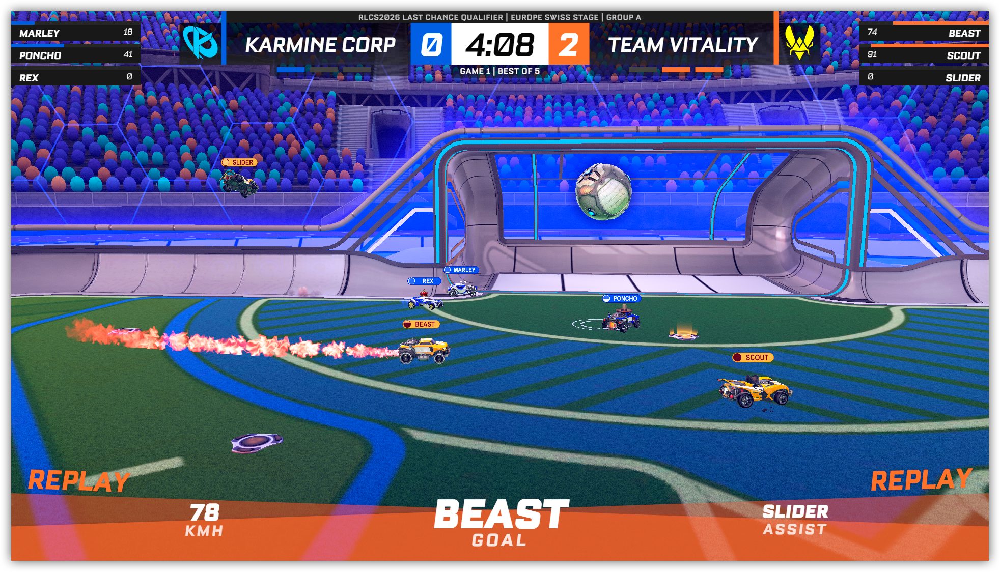

# NE Broadcast Suite

**Professional esports broadcast overlay suite for Windows** — built by [Armour Studios](https://github.com/armour-studios).

[](https://creativecommons.org/licenses/by-nc-nd/4.0/)
[](https://github.com/armour-studios/NEBroadcastSuite/releases/latest)

Runs as a local Electron app. Add browser sources in OBS and get a fully featured production overlay system for live events and online broadcasts.

---

## Download

**[Latest Release →](https://github.com/armour-studios/NEBroadcastSuite/releases/latest)**

Run the installer, launch the app from your desktop shortcut, then add the overlay URLs as browser sources in OBS.

---

## Screenshots

<p align="center">
  
  
</p>
<p align="center">
  
  
</p>
<p align="center">
  
  
</p>

---

## Supported Games

| Game | Data Source | HUD |
|------|------------|-----|
| Rocket League | Official Stats API (TCP port 49123) | Live scoreboard, boost, goal replays |
| CS2 | GSI (Game State Integration) | Minimap radar, scoreboard, round HUD |
| Valorant, Overwatch 2, Apex, and more | Manual / team config | Score, series, team branding |

---

## Features

- **Live overlays** — scoreboard, player HUD, boost meters, kill feed, minimap radar
- **Control panel** — producer cockpit for managing teams, scores, series, and branding live
- **OBS integration** — auto-generates a full scene collection with all overlays wired up
- **Map veto** — guided pick/ban system with per-game pool and format support
- **Replay system** — OBS replay buffer integration with clip editor, playlists, and montage export
- **AI Production Director** — detects key moments and auto-switches OBS scenes
- **Brand kits** — team logos, sponsor banners, color palettes, per-kit overlay themes
- **Twitch integration** — live viewer count, ad break management, chat, EventSub
- **start.gg integration** — pull tournament brackets, team rosters, and event data
- **In-app bug reporter** — sends reports with screenshots directly to our Discord
- **Auto-update** — notifies you and installs updates from GitHub Releases automatically

---

## OBS Setup

After launching the app, add these as **Browser Sources** in OBS (1920×1080):

| Source | URL |
|--------|-----|
| Main overlay / HUD | `http://localhost:3000` |
| Replay player | `http://localhost:3000/replay-player.html` |
| Map veto screen | `http://localhost:3000/mapscreen.html` |
| Bracket | `http://localhost:3000/bracket.html` |

Or use **Settings → OBS → Install Scene Collection** in the control panel to generate a complete OBS scene collection automatically.

---

## Rocket League Setup

Enable the Stats API so the overlay receives live game data:

1. Close Rocket League
2. Open `<RL install dir>/TAGame/Config/DefaultStatsAPI.ini`
3. Set `PacketSendRate=30`
4. Save and launch Rocket League

The overlay connects automatically on TCP port `49123`. No BakkesMod required.

---

## CS2 Setup

Add a GSI config file to enable game state data:

1. Create `gamestate_integration_ne.cfg` in `<CS2 install dir>/game/csgo/cfg/`
2. Paste the contents from `cs2-spectator.cfg` in this repo
3. Restart CS2

---

## Development

```bash
git clone https://github.com/armour-studios/NEBroadcastSuite.git
cd NEBroadcastSuite
npm install
cp .env.example .env.local   # fill in your credentials
npm run dev
```

**Requirements:** Node.js 18+, Windows 10/11

### Environment Variables

See `.env.example` for all available variables. Key ones:

| Variable | Purpose |
|----------|---------|
| `BUG_REPORT_WEBHOOK` | Discord webhook for in-app bug reports |
| `TWITCH_CLIENT_ID` | Twitch app client ID |
| `TWITCH_CLIENT_SECRET` | Twitch app client secret |

### Build

```bash
npm run build          # builds installer to dist/
npm run release        # builds and publishes to GitHub Releases
```

---

## License

© 2026 Armour Studios. Licensed under [CC BY-NC-ND 4.0](https://creativecommons.org/licenses/by-nc-nd/4.0/) — you may share this with attribution, but may not modify it or use it commercially.
